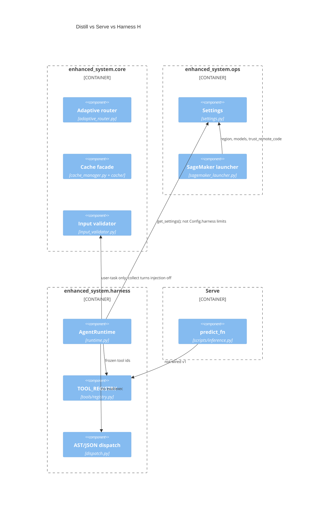

# C4 — Component (L3)

Core + ops remain the inference library. Harness H is a sibling package: it may call `get_settings()` and `InputValidator`, but Serve `predict_fn` does not import the tool loop.

JSON serialization is used for L2/L3 (`docs/adr/0001-json-cache-serialization.md`). All SageMaker CLIs share `MangoMASSageMakerLauncher` (`docs/adr/0002-unify-sagemaker-launchers.md`). Runtime harness–policy pair: `docs/adr/0006-runtime-harness-policy.md`.
