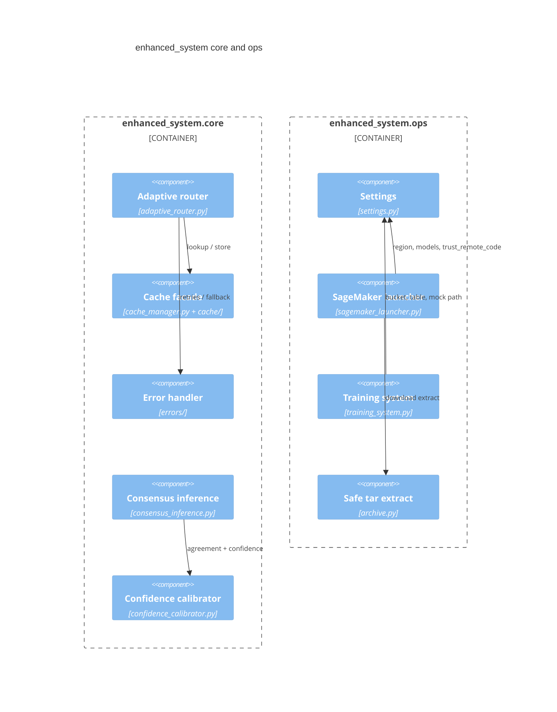

# C4 — Component (L3, core + ops only)

Component view is limited to `enhanced_system/core` and `enhanced_system/ops`. Code-level diagrams are omitted.

JSON serialization is used for L2/L3 (`docs/adr/0001-json-cache-serialization.md`). All SageMaker CLIs share `MangoMASSageMakerLauncher` (`docs/adr/0002-unify-sagemaker-launchers.md`).
