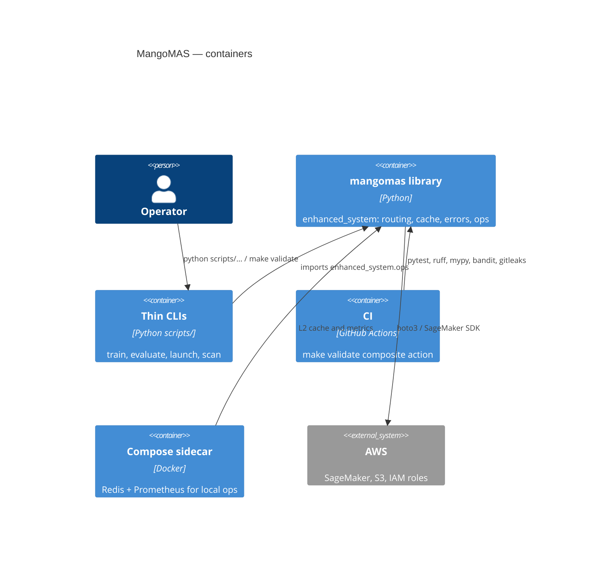

# C4 — Container (L2)

Installable library `mangomas` (`enhanced_system`) plus thin `scripts/` CLIs, GitHub Actions CI, and optional Compose (Redis/Prometheus).

SageMaker training images copy `scripts/training` (entrypoint + `distill/` package). They may not have the full library on `PYTHONPATH`; distill/inference keep a try/except around `get_settings()`.
