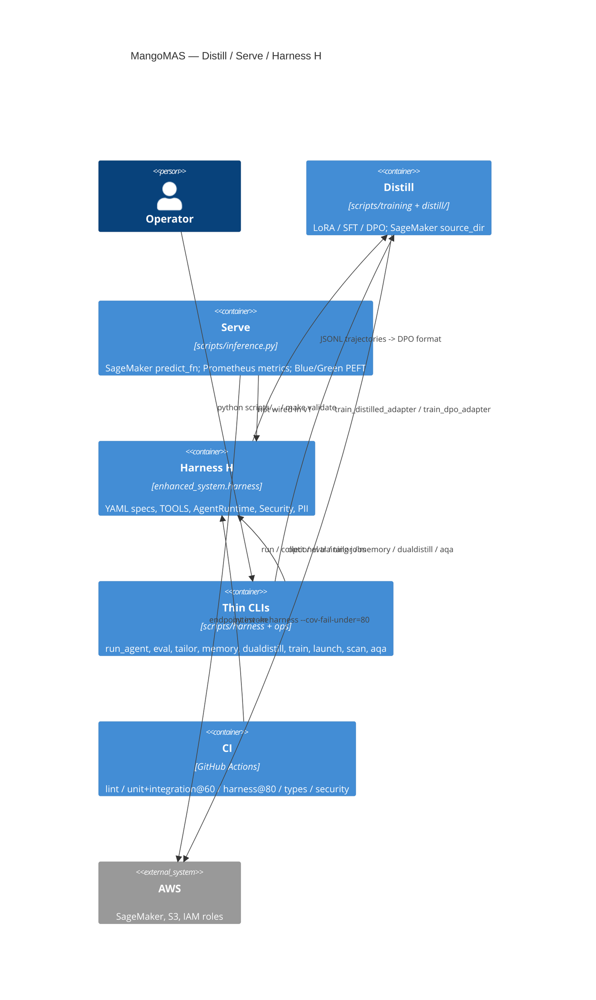

# C4 — Container (L2)

Installable library `mangomas` (`enhanced_system`) plus thin `scripts/` CLIs. Distill, Serve, and Harness H are separate containers of behavior.

SageMaker training images copy `scripts/training` (entrypoint + `distill/` package). They may not have the full library on `PYTHONPATH`; `train_distilled_adapter.py` and `scripts/inference.py` read `MANGOMAS_*` from the environment directly (no `get_settings()` import). Composite `mangomas-validate` is for operators/skills and does not replace the CI jobs.
