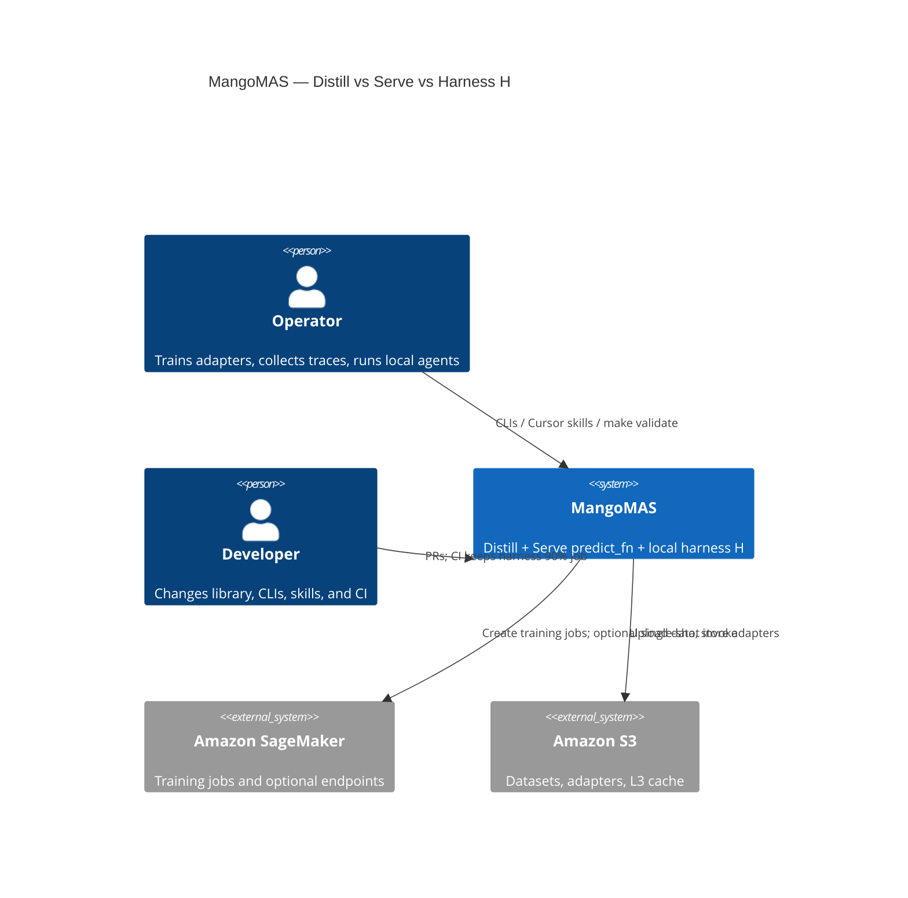

# C4 — Context (L1)

Operators distill role LoRAs, serve them as single-shot SageMaker `predict_fn`, and run tool loops only on the local harness H. Distill, Serve, and Harness are three surfaces of one system.

Serve does **not** call tools. The local harness (`enhanced_system.harness` + `scripts/harness/run_agent.py`) is the only v1 tool loop.
