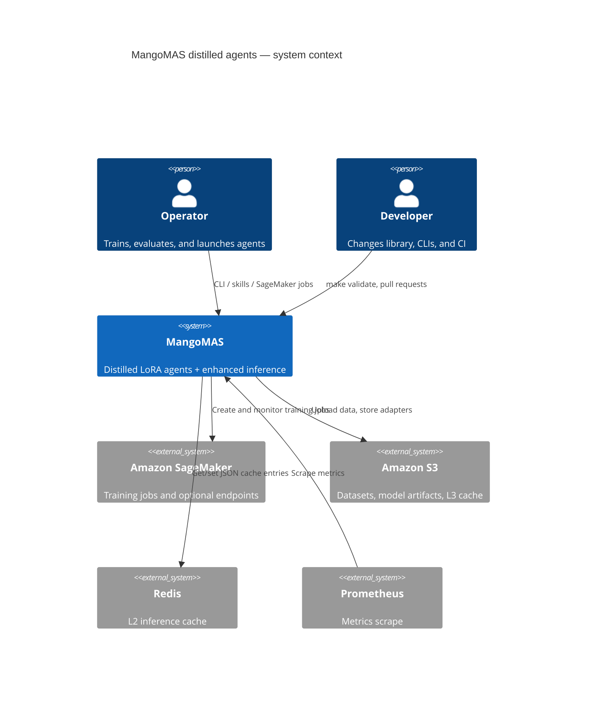

# C4 — Context (L1)

Operators interact with MangoMAS to train, evaluate, and serve distilled agents. The system talks to AWS SageMaker for training, S3 for artifacts and L3 cache, Redis for L2 cache, and Prometheus for metrics.

If the C4 renderer is unavailable, the same relationships are: Operator → MangoMAS → SageMaker/S3/Redis; Prometheus scrapes MangoMAS.
